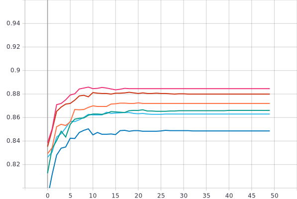

Лабораторная работа #4.
===
Использование техник аугментации данных для улучшения сходимости процесса обучения нейронной сети на примере решения задачи классификации Oregon Wildlife
===
***Аугментация*** - добавление ценности к базовым данным изображения путем добавления дополнительной информации, таким образом увеличивая размер набора данных изображений. 

В данной работе, для решения задачи классификации данных, использовалась нейронная сеть ***EfficientNet-B0*** предобученная на базе изображений ***ImageNet***, с политикой изменения темпа обучения Exp_Decay, который был выбран в качетсве оптимального в предыдущей лабораторной работе с параметрами `initial_lrate = 0.01` - начальный темп обучения, `k = 0.3` - коэффициент наклона экспоненциальной кривой.

1)С использованием техники обучения Transfer Learning и оптимальной политики изменения темпа обучения обучить нейронную сеть EfficientNet-B0 (предварительно обученную на базе изображений imagenet) для решения задачи классификации изображений Oregon WildLife с использованием следующих техник аугментации данных:
---

Манипуляция с яркостью и контрастом:
---

Для реализации данной техники аугментации были написаны 2 функции:
```
def contrast(image,label):
  return tf.image.adjust_contrast(image, 2), label

def brightness(image, label):
  return tf.image.adjust_brightness(image, delta=0.1),label
```
Функции возвращают `tf.image.adjust_brightness(image, delta)` и `tf.image.adjust_contrast(images, contrast_factor)` с параметрами: для яркости ***image*** - входное изображение и ***delta*** - величина для добавления к значениям пикселей, для контрастности ***image*** - входное изображение, ***contrast_factor*** - множитель для регулировки контрастности.

Вызов функции производился в `TFRecordDataset`:
```
return tf.data.TFRecordDataset(filenames)\
    .map(parse_proto_example, num_parallel_calls=tf.data.AUTOTUNE)\
    .map(contrast)\
    .map(brightness)\
    .cache()\
    .batch(batch_size)\
    .prefetch(tf.data.AUTOTUNE)
```

Были выбраны следующие параметры для нахождения оптимальных:
```
contrast_factor = 0.5, delta = 0.1;
contrast_factor = 2, delta = 0.1;
contrast_factor = 2, delta = 0.5;
contrast_factor = 5, delta = 0.1;
contrast_factor = 5, delta = 0.5;
```


Графики обучения для нейронной сети EfficientNetB0(предварительно обученной на базе изображений imagenet) с использованием оптимальной политики изменения темпа обучения и техникой аугментации данных (Манипуляция с яркостью и контрастом):
---

***Линейная диаграмма точности:***


***Линейная диаграмма потерь:*** 


   
 
***Анализ результатов:***    

Из графиков видно, что:
* При параметрах `contrast_factor = 0.5, delta = 0.1;` сошелся на 23 эпохе, точность на валидационном наборе данных = 88.69%, потери = 0.2725.
* При параметрах `contrast_factor = 2, delta = 0.1;` сошелся на 21 эпохе, точность на валидационном наборе данных = 90.1%, потери = 0.2232.
* При параметрах `contrast_factor = 2, delta = 0.5;` сошелся на 25 эпохе, точность на валидационном наборе данных = 90.15%, потери = 0.2281.
* При параметрах `contrast_factor = 5, delta = 0.1;` сошелся на 23 эпохе, точность на валидационном наборе данных = 71%, потери = 0.8728.
* При параметрах `contrast_factor = 5, delta = 0.5;` сошелся на 30 эпохе, точность на валидационном наборе данных = 71.49%, потери 0.8663.
Оптимальными параметрами для яркости/контраста в данном случае будут `contrast_factor = 2, delta = 0.1;` при условии, что точность на выходе лучше при параметрах `contrast_factor = 2, delta = 0.5;` на 0.05%,но скорость сходимости больше на 4 эпохи, потери больше на 0.0049 

Поворот изображения на случайный угол:
---
 
Графики обучения для нейронной сети EfficientNetB0(предварительно обученной на базе изображений imagenet) с использованием оптимальной политики изменения темпа обучения и техникой аугментации данных (Поворот изображения на случайный угол):
---

***Линейная диаграмма точности:***


***Линейная диаграмма потерь:***


   
 
 ***Анализ результатов:*** 
 
 Графики обучения для нейронной сети EfficientNetB0(предварительно обученной на базе изображений imagenet) с использованием оптимальной политики изменения темпа обучения и техникой аугментации данных (Поворот изображения на случайный угол(влияние режимов заполнения)):
---

***Линейная диаграмма точности:***


***Линейная диаграмма потерь:*** 


  
 
 ***Анализ результатов:*** 
 
Добавление случайного шума:
---
 
 Графики обучения для нейронной сети EfficientNetB0(предварительно обученной на базе изображений imagenet) с использованием оптимальной политики изменения темпа обучения и техникой аугментации данных (Добавление случайного шума):
---

***Линейная диаграмма точности:***


***Линейная диаграмма потерь:*** 


   
 
***Анализ результатов:*** 

Использование случайной части изображения:
---

Графики обучения для нейронной сети EfficientNetB0(предварительно обученной на базе изображений imagenet) с использованием оптимальной политики изменения темпа обучения и техникой аугментации данных (Использование случайной части изображения):
---

***Линейная диаграмма точности:***




***Линейная диаграмма потерь:*** 


   
 
***Анализ результатов:*** 
 
 
