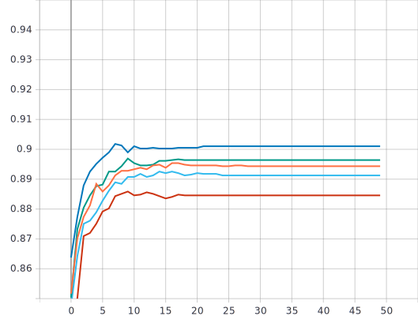

Лабораторная работа #4.
===
Использование техник аугментации данных для улучшения сходимости процесса обучения нейронной сети на примере решения задачи классификации Oregon Wildlife
===
***Аугментация*** - добавление ценности к базовым данным изображения путем добавления дополнительной информации, таким образом увеличивая размер набора данных изображений. 

В данной работе, для решения задачи классификации данных, использовалась нейронная сеть ***EfficientNet-B0*** предобученная на базе изображений ***ImageNet***, с политикой изменения темпа обучения Exp_Decay, который был выбран в качетсве оптимального в предыдущей лабораторной работе с параметрами `initial_lrate = 0.01` - начальный темп обучения, `k = 0.3` - коэффициент наклона экспоненциальной кривой.

1)С использованием техники обучения Transfer Learning и оптимальной политики изменения темпа обучения обучить нейронную сеть EfficientNet-B0 (предварительно обученную на базе изображений imagenet) для решения задачи классификации изображений Oregon WildLife с использованием следующих техник аугментации данных:
---

Манипуляция с яркостью и контрастом:
---

Для реализации данной техники аугментации были написаны 2 функции:
```
def contrast(image,label):
  return tf.image.adjust_contrast(image, 2), label

def brightness(image, label):
  return tf.image.adjust_brightness(image, delta=0.1),label
```
Функции возвращают `tf.image.adjust_brightness(image, delta)` и `tf.image.adjust_contrast(images, contrast_factor)` с параметрами: для яркости `image` - входное изображение и `delta` - величина для добавления к значениям пикселей, для контрастности `image` - входное изображение, `contrast_factor` - множитель для регулировки контрастности.

Вызов функции производился в `TFRecordDataset`:
```
return tf.data.TFRecordDataset(filenames)\
    .map(parse_proto_example, num_parallel_calls=tf.data.AUTOTUNE)\
    .map(contrast)\
    .map(brightness)\
    .cache()\
    .batch(batch_size)\
    .prefetch(tf.data.AUTOTUNE)
```

Были выбраны следующие параметры для нахождения оптимальных:
```
contrast_factor = 0.5, delta = 0.1;
contrast_factor = 2, delta = 0.1;
contrast_factor = 2, delta = 0.5;
contrast_factor = 5, delta = 0.1;
contrast_factor = 5, delta = 0.5;
```


Графики обучения для нейронной сети EfficientNetB0(предварительно обученной на базе изображений imagenet) с использованием оптимальной политики изменения темпа обучения и техникой аугментации данных (Манипуляция с яркостью и контрастом):
---

***Линейная диаграмма точности:***


***Линейная диаграмма потерь:*** 


   
 
***Анализ результатов:***    

Из графиков видно, что:
* При параметрах `contrast_factor = 0.5, delta = 0.1;` сошелся на 23 эпохе, точность на валидационном наборе данных = 88.69%, потери = 0.2725.
* При параметрах `contrast_factor = 2, delta = 0.1;` сошелся на 21 эпохе, точность на валидационном наборе данных = 90.1%, потери = 0.2232.
* При параметрах `contrast_factor = 2, delta = 0.5;` сошелся на 25 эпохе, точность на валидационном наборе данных = 90.15%, потери = 0.2281.
* При параметрах `contrast_factor = 5, delta = 0.1;` сошелся на 23 эпохе, точность на валидационном наборе данных = 71%, потери = 0.8728.
* При параметрах `contrast_factor = 5, delta = 0.5;` сошелся на 30 эпохе, точность на валидационном наборе данных = 71.49%, потери 0.8663.   

Оптимальными параметрами для яркости/контраста в данном случае будут `contrast_factor = 2, delta = 0.1;` при условии, что метрика точности на выходе лучше при параметрах `contrast_factor = 2, delta = 0.5;` на 0.05%, но скорость сходимости больше на 4 эпохи, потери больше на 0.0049. 

Поворот изображения на случайный угол:
---

Для реализации данной техники аугментации в архитектуру нейронной сети был добавлен слой:
```
x = tf.keras.layers.experimental.preprocessing.RandomRotation(factor=(0, 0.25))(inputs)
```

По умолчанию RandomRotation применяются только во время обучения. В момент вывода слой ничего не делает.
Random Rotation используется с помощью preprocessing. Основная задача препроцессинга - отображение данных в формат пригодный для обучения модели.

Параметры, используемые в RandomRotation: `factor` - величина представляющая собой верхнюю и нижнюю границу для вращения изображения как по часовой стрелке так и против. Положительное значение - вращение по часовой стрелке, отрицательное - против часовой стрелки. При передаче в `factor` одного значения `factor = 0.25`, то случайное вращение будет в диапазоне (-25% * 2pi, 25% * 2pi), а если 2 `factor = (0, 0.25)`, то случайное вращение будет в диапазоне (0 * 2pi, 25% * 2pi).

Были выбраны следующие параметры для нахождения оптимальных:
```
factor = (0, 0.5); //диапазон от 0 до 180 градусов
factor = (0, 0.25); //диапазон от 0 до 90 градусов
factor = (0, 0.125); //диапазон от 0 до 45 градусов
factor = (0, 0.025); //диапазон от 0 до 9 градусов
```

Графики обучения для нейронной сети EfficientNetB0(предварительно обученной на базе изображений imagenet) с использованием оптимальной политики изменения темпа обучения и техникой аугментации данных (Поворот изображения на случайный угол):
---

***Линейная диаграмма точности:***


***Линейная диаграмма потерь:***


   
 
 ***Анализ результатов:*** 
 
 Из графиков видно, что:
 * При параметре `factor = (0, 0.5);` сошелся на 30 эпохе, точность на валидационном наборе данных = 84.32%, потери = 0.3592.
 * При параметре `factor = (0, 0.25);` сошелся на 25 эпохе, точность на валидационном наборе данных = 85.24%, потери = 0.3174.
 * При параметре `factor = (0, 0.125);` сошелся на 26 эпохе, точность на валидационном наборе данных = 87.04%, потери = 0.2803.
 * При параметре `factor = (0, 0.025);` сошелся на 24 эпохе, точность на валидационном наборе данных = 89.13%, потери = 0.2477.
 Так же видно, что, чем меньше диапазон для случайного вращения по часовой стрелке, тем лучше сходимость, выше метрика точности и меньше ошибки.  
 
 Следовательно, оптимальные параметры для случайного вращения - `factor = (0, 0.025);`

Поворот изображения на случайный угол(влияние режимов заполнения)
---
 
Помимо параметра `factor` в RandomRotation присутствует параметр `fill_mode` - точки за пределами границ ввода заполняются в соответствии с заданным режимом:
* `constant` - входные данные расширяются путем заполнения всех значений за краем одним и тем же постоянным значением k = 0.
* `reflect` - входные данные расширяются засчет отражения о край последнего пикселя.
* `wrap` - входные данные расширяются путем обертывания вокруг противополодного края.
* `nearest` -входные данные расширяются засчет ближайшего пикселя.
 
 Графики обучения для нейронной сети EfficientNetB0(предварительно обученной на базе изображений imagenet) с использованием оптимальной политики изменения темпа обучения и техникой аугментации данных (Поворот изображения на случайный угол(влияние режимов заполнения)):
---

***Линейная диаграмма точности:***


***Линейная диаграмма потерь:*** 


  
 
 ***Анализ результатов:*** 
 В качетсве параметра `factor` был выбран оптимальный, то есть `factor = (0, 0.025);`
 Из графиков видно, что:
 * При параметрах `factor = (0, 0.025), fill_mode = 'constant';` сошелся на 28 эпохе, точность на валидационном наборе данных = 88.38%, потери = 0.2487.
 * При параметрах `factor = (0, 0.025), fill_mode = 'nearest';` сошелся на 25 эпохе, точность на валидационном наборе данных = 88.92%, потери = 0.247.
 * При параметрах `factor = (0, 0.025), fill_mode = 'reflect';` сошелся на 28 эпохе, точность на валидационном наборе данных = 88.89%, потери = 0.2463.
 * При параметрах `factor = (0, 0.025), fill_mode = 'wrap';` сошелся на 26 эпохе, точность на валидационном наборе данных = 89%, потери = 0.2467.
 * При параметре `factor = (0, 0.025);` сошелся на 24 эпохе, точность на валидационном наборе данных = 89.13%, потери = 0.2477.

Можно сделать вывод, что режим заполнения не повлиял положительным образом на результат:
* Cкорость сходимости меньше, даже в самом ближайшем результате `factor = (0, 0.025), fill_mode = 'nearest';` сходимость дольше на 1 эпоху, метрика точности меньше на 0.21%, ошибка меньше на 0.0007.
* При параметрах  `factor = (0, 0.025), fill_mode = 'wrap';` метрика точности максимально близко приблизилась, но все равно меньше на 0.13%, сходится на 2 эпохи дольше, при этом ошибки на 0.001 меньше.

Среди всех параметров, использованных в работе, оптимальным будет RandomRotation c `factor = (0, 0.025);`  
  
 
Добавление случайного шума:
---

Для реализации данной техники аугментации в архитектуру нейронной сети был добавлен слой:
```
x = tf.keras.layers.GaussianNoise(0.01)(inputs)
```
в общем виде
```
tf.keras.layers.GaussianNoise(stddev)
```
где `stddev` - значение среднеквадратичного отклонения добавляемого шума.

Были выбраны следующие параметры для нахождения оптимальных:
```
stddev = 0.01; 
stddev = 0.05;
stddev = 0.1; 
stddev = 0.5; 
stddev = 1;
```
 
 Графики обучения для нейронной сети EfficientNetB0(предварительно обученной на базе изображений imagenet) с использованием оптимальной политики изменения темпа обучения и техникой аугментации данных (Добавление случайного шума):
---

***Линейная диаграмма точности:***


***Линейная диаграмма потерь:*** 


   
 
***Анализ результатов:*** 

Из графиков видно, что:
 * При параметре `stddev = 0.01;` сошелся на 29 эпохе, точность на валидационном наборе данных = 89.54%, потери = 0.2364.
 * При параметре `stddev = 0.05;` сошелся на 18 эпохе, точность на валидационном наборе данных = 89.64%, потери = 0.236.
 * При параметре `stddev = 0.1;` сошелся на 26 эпохе, точность на валидационном наборе данных = 89.59%, потери = 0.2346.
 * При параметре `stddev = 0.5;` сошелся на 29 эпохе, точность на валидационном наборе данных = 89.38%, потери = 0.2336.
 * При параметре `stddev = 1;` сошелся на 23 эпохе, точность на валидационном наборе данных = 89.36%, потери = 0.241.

Следовательно оптимальное значение при параметре `stddev = 0.05;`.


Использование случайной части изображения:
---

Для реализации данной техники аугментации в архитектуру нейронной сети были добавлены слои:
```
x = tf.keras.layers.experimental.preprocessing.Resizing(250,250)(inputs)
x = tf.keras.layers.experimental.preprocessing.RandomCrop(224,224)(x)
```
Resizing используется для увеличения входного изображения на определенное значение,для дальнейшего RandomCrop до размеров, используемых нейронной сетью ***EfficientNet-B0***.

В общем виде:
```
tf.keras.layers.experimental.preprocessing.RandomCrop(height, width)
```
где: `height` и `width` - высота и ширина соответственно.

Были выбраны следующие параметры для нахождения оптимальных:
```
Resizing(235,235) RandomCrop(224,224);
Resizing(250,250) RandomCrop(224,224);
Resizing(300,300) RandomCrop(224,224);
Resizing(336,336) RandomCrop(224,224);
Resizing(350,350) RandomCrop(224,224);
Resizing(448,448) RandomCrop(224,224);
```

Графики обучения для нейронной сети EfficientNetB0(предварительно обученной на базе изображений imagenet) с использованием оптимальной политики изменения темпа обучения и техникой аугментации данных (Использование случайной части изображения):
---

***Линейная диаграмма точности:***


***Линейная диаграмма потерь:*** 


   
 
***Анализ результатов:*** 

Из графиков видно, что:
 * При параметрах `Resizing(235,235) RandomCrop(224,224);` сошелся на 18 эпохе, точность на валидационном наборе данных = 88.46%, потери = 0.2654.
 * При параметрах `Resizing(250,250) RandomCrop(224,224);` сошелся на 31 эпохе, точность на валидационном наборе данных = 87.99%, потери = 0.2678.
 * При параметрах `Resizing(300,300) RandomCrop(224,224);` сошелся на 21 эпохе, точность на валидационном наборе данных = 87.2%, потери = 0.2913.
 * При параметрах `Resizing(336,336) RandomCrop(224,224);` сошелся на 40 эпохе, точность на валидационном наборе данных = 86.61%, потери = 0.3057.
 * При параметрах `Resizing(350,350) RandomCrop(224,224);` сошелся на 26 эпохе, точность на валидационном наборе данных = 86.3%, потери = 0.2996.
 * При параметрах `Resizing(448,448) RandomCrop(224,224);` сошелся на 32 эпохе, точность на валидационном наборе данных = 84.86%, потери = 0.3317.

Следовательно оптимальное значение при параметрах `Resizing(235,235) RandomCrop(224,224);`.

Сравнение оптимальных значений
---

Для сравнения будем использовать оптимальные параметры всех техник аугментации данных из этой лабораторной и оптимального темпа обчения Exp_Decay из предыдущей лабораторной работы.
Оптимальные параметры следующие:
```
Resizing(235,235) RandomCrop(224,224);
GaussianNoise: stddev = 0.05;
RandomRotation: factor = (0, 0.025);
Contrast/brightness: contrast_factor = 2, delta = 0.1;
Exp_Decay: initial_lrate = 0.01 и k = 0.3;
```
Графики обучения для нейронной сети EfficientNetB0(предварительно обученной на базе изображений imagenet) с использованием оптимальной политики изменения темпа обучения и техниками аугментации данных(Манипуляция с яркостью и контрастом; Поворот изображения на случайный угол; Использование случайной части изображения; Добавление случайного шума) и без техник аугментации данных
---
***Линейная диаграмма точности:***




***Линейная диаграмма потерь:*** 


   
 
***Анализ результатов:*** 


 
 
